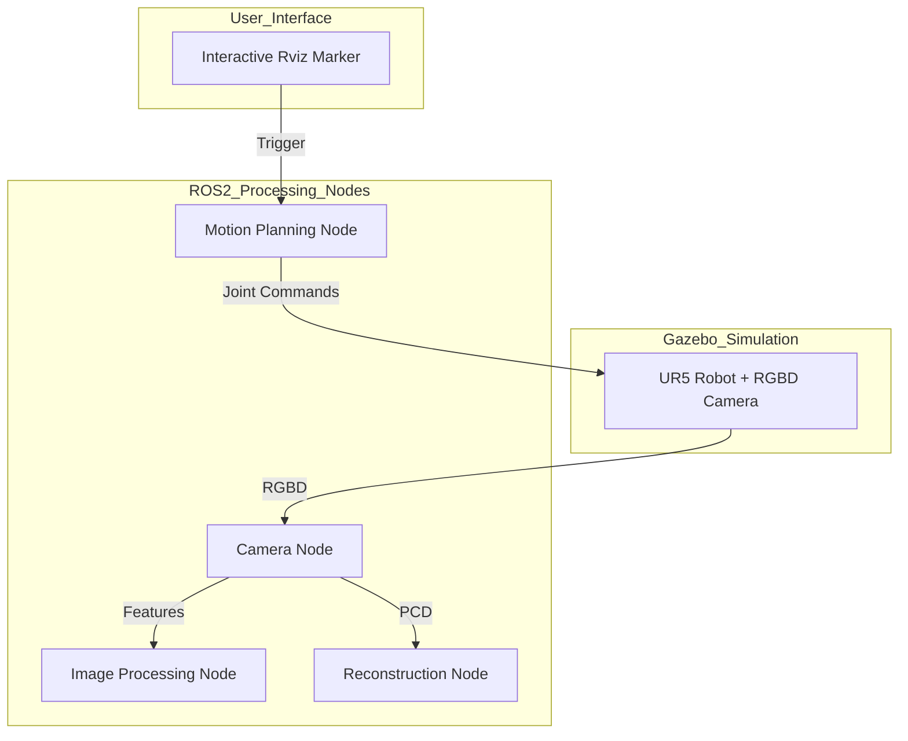

# UR5 3D Object Scanner & Reconstruction

A ROS 2 and Gazebo-based pipeline for multi-view 3D object reconstruction using a UR5 robotic arm.

## 📊 System Architecture




## 🚀 Features
- **Gazebo Simulation**: Automated environment with a UR5 arm and RGB-D camera.
- **Motion Planning**: Pre-configured scanning poses to sweep around objects.
- **Real-time Processing**: ORB feature extraction and colored PointCloud2 generation.
- **3D Reconstruction**: Poisson surface reconstruction to generate high-quality 3D meshes (`.obj`) and point clouds (`.ply`).
- **Portable Design**: Fully configurable paths using ROS parameters.

## 🛠️ Prerequisites

### Hardware
- Linux (Ubuntu 24.04 recommended)
- Disk space for datasets (~100MB+)

### Software Dependencies
Ensure you have ROS 2 Jazzy installed, then install the following:

```bash
# ROS 2 Dependencies
sudo apt update
sudo apt install ros-jazzy-ros-gz-sim \
                 ros-jazzy-ros-gz-bridge \
                 ros-jazzy-cv-bridge \
                 ros-jazzy-tf2-ros \
                 ros-jazzy-ur-description \
                 ros-jazzy-controller-manager \
                 ros-jazzy-joint-trajectory-controller \
                 ros-jazzy-joint-state-broadcaster

# Python Dependencies
pip install open3d numpy opencv-python scipy
```

## 📂 Installation

1. Create a workspace:
   ```bash
   mkdir -p ~/ur5_ws/src
   cd ~/ur5_ws/src
   ```
2. Clone the repository:
   ```bash
   git clone https://github.com/ThanushreeN27/ur5-3d-object-scanner-reconstruction.git ur5_scan_sim
   ```
3. Build the workspace:
   ```bash
   cd ~/ur5_ws
   colcon build --symlink-install
   source install/setup.bash
   ```

## 🎮 How to Run

### 1. Launch Simulation
Start the Gazebo environment, Rviz visualization, and robot controllers:
```bash
ros2 launch ur5_scan_sim sim.launch.py
```

### 2. Start Scanning & Data Capture
In a new terminal:
```bash
# To move the robot
ros2 run ur5_scan_sim motion_planning_node.py

# To save images and poses to your dataset
ros2 run ur5_scan_sim camera_node.py
```

### 3. Real-time PointCloud & Reconstruction
In a new terminal:
```bash
# Process images into point clouds
ros2 run ur5_scan_sim image_processing_node.py

# Accumulate and generate the 3D mesh
ros2 run ur5_scan_sim reconstruction_node.py
```

## ⚙️ Configuration
You can customize output paths via ROS parameters:
```bash
ros2 run ur5_scan_sim camera_node.py --ros-args -p save_dir:="~/my_dataset"
```

## 📄 License
This project is licensed under the MIT License - see the [LICENSE](LICENSE) file for details.
